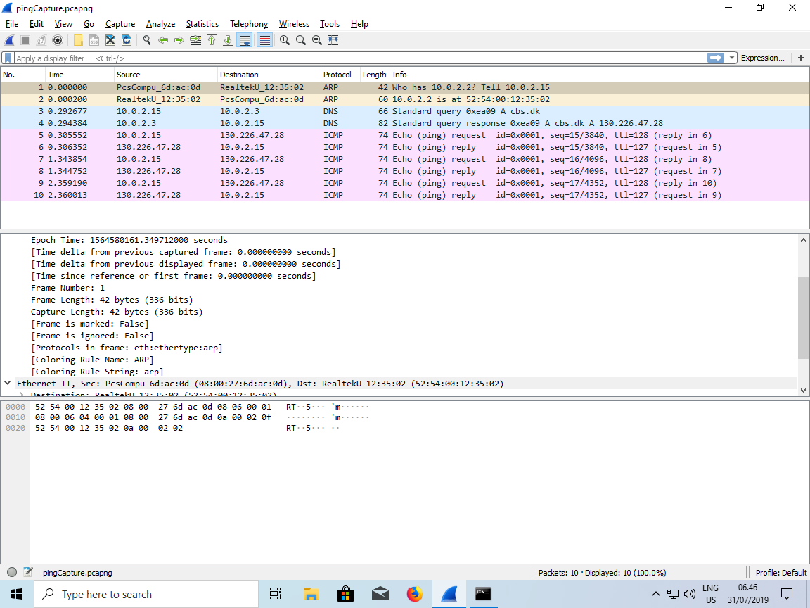
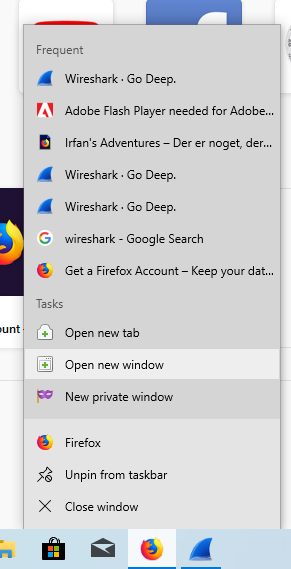
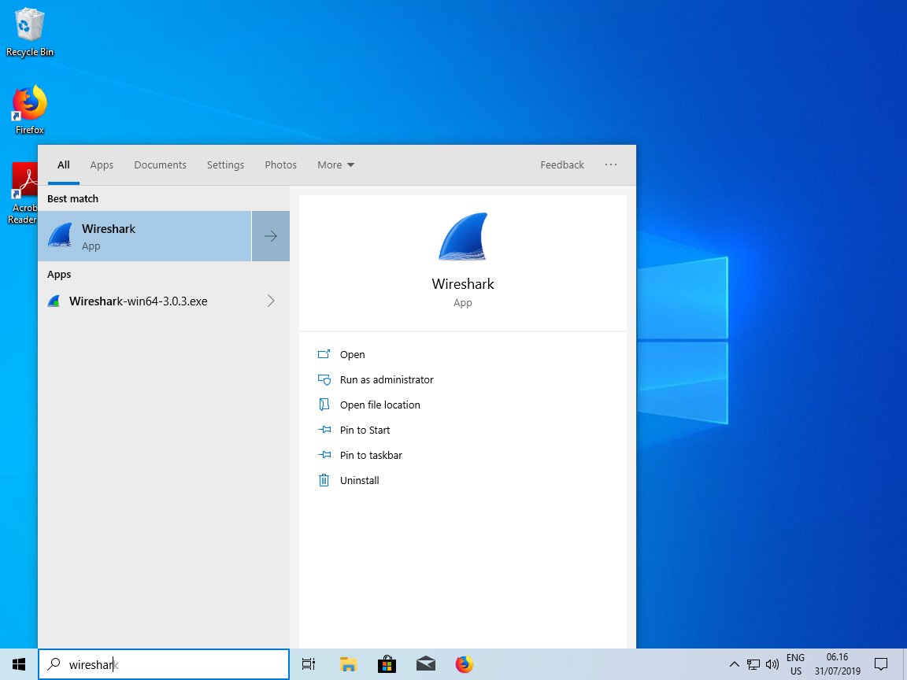
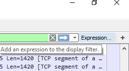
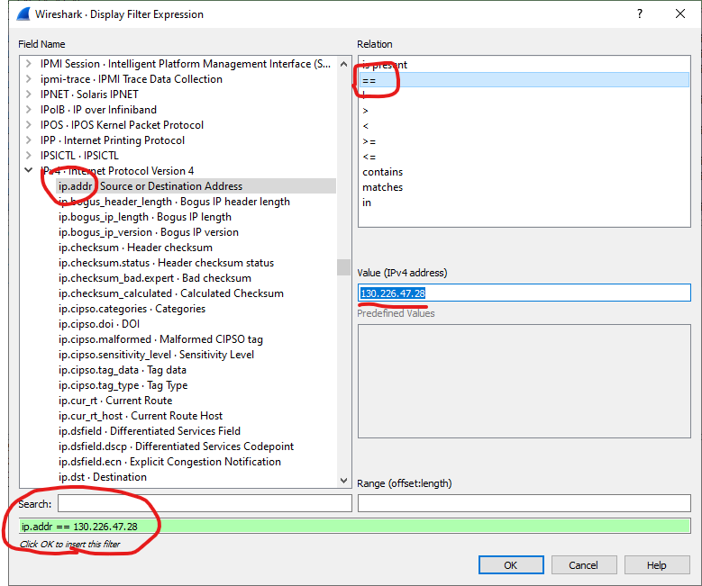
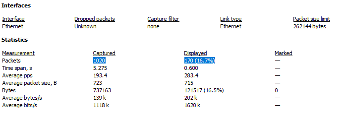
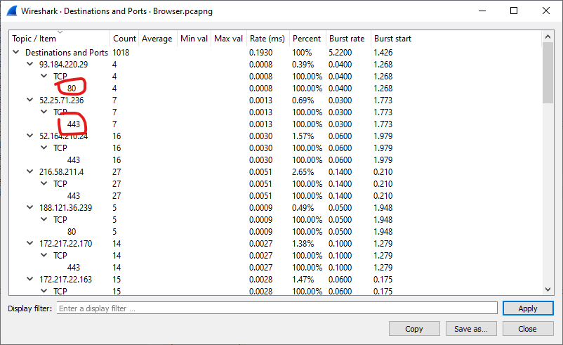

# Wireshark

Today's exercise is to solidify the concepts learned in the classroom. We will specifically focus on the TCP/IP 5 Layer Stack and how it looks in action.

For this purpose we will use a tool called wireshark. Wireshark is a packet sniffer. It can be used to record and inspect traffic going through your network interfaces (wireless, ethernet...).

Wireshark listens to all the packages going through the interface and records them. If you follow security news, you will see that it is often used to trace malware communication to command and control servers.

You should be careful when using this tool in organizational networks. Since there is the possibility of intercepting traffic not meant for you, you may violate the law or the organizational policy. This is why I recommend not using wireshark outside of your home network.

I include two exercises here. One simple and one a bit more advanced. If you still have time on your hands after you are done, you can just capture packages from your computer at rest and see all the background chatter originating from your machine. Who knows, may be you will catch some bad guys...

## Installation

Wireshark is an open source tool and can be freely obtained from [https://www.wireshark.org/](https://www.wireshark.org/).

Download the appropriate version for your computer and run the downloaded file.

Installation is straighforward. Default settings are sane and you don't need to change anything. Just proceed as advised.

At the end of the installation you will need to restart your computer.

## Wireshark Analysis Simple

Click the link below to download the pcapng file. This is from a capture I made earlier. I pinged the cbs.dk server 3 times and recorded the results. It also includes the ARP, and DNS exchanges to figure out the route to cbs.dk. See [this document](ping.md) for details on how capture was carried out.

[ping capture](wiresharkData/pingCapture.pcapng)

You can open the downloaded file in wireshark. Either double click it, or go through the File > Open dialogue.

This is what it should look like:

You can see we intercepted 10 packages in about 2 seconds.

Since my computer did not know how to get to cbs.dk, some address resolution was necessary. Now I want you to look at the protocol column. Some of these protocols should be similar from in class demoland activities.

ARP protocol to resolve IP addresses to MAC addresses (Layer 2).

DNS protocol to resolve URL (cbs.dk) to IP addresses.

Finally ICMP packages our ping command generated.

If you look at the source and destination addresses you will see that each packet we generated on our end (My IP address was 10.02.15) was answered by a response.

### DNS Packet

Let us take a look at the first DNS packet. Click the first DNS packet.

Now the middle part of the screen shows the information the packet contains.

From top to bottom, these correspond to the five layers of the TCP/IP protocol stack.

You can see the source and destination MAC addresses in layer 2 (Link).

Source and destination IP addresses in layer 3 (Network).

The transport protocol used (UDP) in layer 4 (Transport).

And finally the application protocol in layer 5 (DNS).

Let us investigate layer 5. We know that our computer asks the DNS server about cbs.dk. Click "Domain Name System (query)" to see the information contained in that layer.

You can see the interpretation of the protocol in human readable format in the middle pane. The bottom pane displays the hexadecimal representation of the data.

To finish up, let us inspect the response from the DNS server. Click on the next DNS packet. 

You can see in the response the addresses of the destination and source are switched. So this message is from the DNS server (10.0.2.3) to my computer (10.0.2.15).

The answer indicates cbs.dk can be reached at 130.226.47.28.

### ICMP Ping

ICMP is a protocol used by network devices to communicate with each other. It is used to send error messages, and operational information. As such it is not used to exchange data. We used ICMP protocol to verify that cbs.dk was up.

Since ICMP is a layer 3 protocol (remember routers operate at layer 3) you will see that the transport layer headers are missing.

What I want you to note here is the time differences between requests and responses. You might be familiar with ping as a measure of latency in online games. Essentially it is measuring how long it takes to get information from the server.

## Wireshark Capture

Now you know how to look at the data, you can also capture your own traffic. The capture you analyzed earlier was captured using Wireshark.

It is important to keep your network activity very limited during this exercise. Your computer generates quite a few packages by itself. You browsing the net during capture may produce an overwhelming number of packages. If you have services that use network data (dropbox, spotify, etc.), it may be a good idea to turn them off.

Open a new browser window without any tabs. Other tabs may create unnecessary traffic.

Launch wireshark. You can find it in the Start Menu.

After wireshark initializes you can see a list of network interfaces.

Depending on your hardware, there will probably be a wired ethernet and a wireless ethernet adapter (and may be a few other odds and ends).

Select the interface you want to use. Correct interface depends on how you connect to the network. I will be using wired ethernet (as my workstation does not have a wireless interface).

Once you select the interface the capture icon on the top left will become clickable. The capture icon looks like a shark fin. 

After you click the capture button, switch to the browser window and type in cbs.dk in the address bar and press enter.

As soon as you see the cbs.dk landing page, switch back to wireshark and click the red square on the top right corner to stop capture. We don't want to capture any other traffic (It can get confusing otherwise).

This is how it should look like after the capture.

## Wireshark Analysis - Filters

That visit to CBS.dk generated over a thousand packages in the 5 seconds it took me to complete it. For compatibility purposes, find attached my capture.

[Browser Capture](wiresharkData/browser.pcapng)

Making sense of ten packets as we did before is easy. When it is real traffic, we need some filtering capabilities. The true beauty of wireshark is the filtering capabilities.

Let us start small.

1 - As you saw, there is a lot of traffic. Let's say I am interested only in packages to and from cbs.dk.

We know that the ip address of cbs.dk is 130.226.47.28. We can create a filter to show only the packages that contain 130.226.47.28 as the ip address.

Click the expression next to the filter bar.

Now you see a long list of protocols that are used in modern networking. We talked about 5 layers. These are the protocols that populate those layers.

So the protocol we are interested in is the IP protocol. Scroll down the list until you see IPv4.

We need ip.addr as the field, == as the relation, and 130.226.47.28 as the value.

2 - It is also possible to link multiple filters together with logical operators (and, or, not...).

For example let us say I am only interested in encrypted traffic using tls protocol. We can change the filter to read: 

    ip.addr == 130.226.47.28 and tls

3 - Now we know the packages related to the web content coming from cbs.dk. What about all the rest?

Let us look at some statistics.

Statistics > Choose Capture File Propreties.

The packages we filtered out as content make up only 17% of the packages. You can broaden the filter by removing tls and notice that the traffic from cbs.dk makes up only 60% of the packages captured.

4 - Where are all these other packages coming from?

Statistics > Resolved Addresses

17 different IP addresses. Mostly related to advertisements.

5 - Investigate the ports associated with IP destinations to see what services are being used.

Statistics > IPv4 Statistics > Destinations and Ports

Remember ports are used to direct traffic to programs installed on a computer. Some of these ports are registered for certain purposes.

Port 80 is used by web servers for HTTP traffic.

Port 443 is used for encrypted version of HTTP.

You will see other ports as well. You can look up what they are on google.

## Wireshark Conclusion

There is so much more you can do with wireshark. Using wireshark you can detect intruders in your home wifi network (Look at MAC addresses), or bitcoin mining trojans installed on your computer (anyone using bitcoin protocol?).

What we did today is just scratching the surface, but if you are interested you can add this as a great tool under your tool belt.