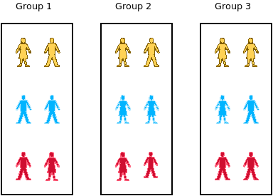
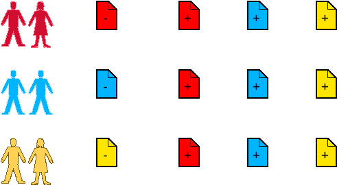
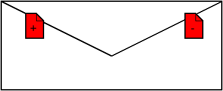

# A Simple Game to Reinforce The Information Security Basics

This document will walk the teacher through the Cryptography Game. An inclass activity that can be used to solidfy the information security principles and how asymmetric key cryptography can help implement them.

While the idea behind asymmetric key cryptography is simple once understood, it is not easy to grasp. This game is designed to solve that. We highly recommend the teachers familiarize themselves with the game in its entirety and information security principles before starting the exercise, as misunderstandings may derail the exercise.

Depending on the class size this activity takes about 40-60 minutes.

## Materials

Before you can start the game you will need various props. You can probably use other material in stead of what we recommend, but we have used the following materials in the past with success.

* Envelopes: number depends on number of players.
* Colorful post it notes: more distinct colors the better but at least 3 different colors.

## Setup

The activity requires a minimum of 3 students to play. In the activity each player will try to do three things: (1) send a message, (2) intercept a message, and (3) receive a message. While trying to fulfil confidentiality or authentication. The game requires physical exchange of envelopes. Therefore some consideration should be given to the physical location of teams and groups.

**1- Form Teams:** We have played this game with classess of up to 60 students. We recommend students are formed into teams of three to five people for this activity. If you have a small class (9 - 12 students) you may play the game as individuals. Our experience is that, the students learn more from the discussion with each other. Therefore we recommend teams.

**2- Form Groups of Teams:** We will have three teams in each group. The group will carry out the activity as a unit. So the teams in a group will only interact with other teams in the same group.

**3- Designate Roles:** Each team in a group will fulfill all of the following roles: (1) sender, (2) receiver, (3) threat.

| For Team | Threat | Destination |
|----------|--------|-------------|
| Red      | Blue   | Yellow      |
| Yellow   | Red    | Blue        |
| Blue     | Yellow | Red         |

**4- Explain the Message Exchange:** The roles will determine how the messages (envelopes) are handed off. Every team will try to send a message to their destination team, but the message first needs to go through threat team.

So in our example: The red team will try to communicate with yellow team, but all their messages will need to first go through the blue team.

Make sure each team knows who they need to ultimately reach and who they need to first hand their messages to.

**5- Generate Key Pairs** Hand each team a different colored post-it note stack so that within the group each team has different colored post-it notes. 

Teams in different groups can have the same color, as the teams only interact with the other teams within their own group. In other words, the colors may be the same across groups but should be different within each group.

Remind the students of the difference between the public (+) and private (-) keys. Public keys are shared with all and private keys are held as secrets.

Remind the students that in order to decrypt a message (open an envelope) they need both the public and private key of the same keypair (same color post-its).

Instruct each team to put a minus sign (or write private) on a single post it note. This is their private key.

Instruct each team to put a plus sign (or write public) on three post it notes. These are their public keys.

Instruct each team to hand one public key (plus signed) post it note to the other teams in their group.

At the end of this step each team should have (1) their own private key, (2) three public keys from the teams in their group.

**6- Explain Rules of Sending Messages:** 

Explain the following rules to the students. It may be helpful to write these on the board.

Rules:

1- In order to encrypt a message with a key, students need to stick the post it to the envelope.

2- Once an envelope has a post it on it, it can only be decrypted (opened) if the corresponding post it of the same color (but different sign) is also stuck on the envelope.

3- Once a post is stuck on the envelope it can't be removed or altered.

We recommend the teacher demonstrate these actions with an envelope and some post-it notes.

The last rule is to prevent confusion between key exchange (step 5 of setup) and message exchange (an in game action). The act of sticking the post-it note does not symbolize adding the key to the message, it symbolizes encrypting the message with the given key. It is important that this point is clear, otherwise students may get confused that they are sticking their private key onto the envelope and handing their private key to the other teams. With this last rule, that no longer is a problem.

**7- Setup Done:** Once each team has the required keys, we can begin the activity. Students may be a bit distracted at this step after all the shuffling around. Therefore it helps to tell them explicitly that the setup is over and the game can begin.

 
\pagebreak 

## First Game: Confidentiality

In this game our goal is to ensure confidentiality. That the messages can only be read by their intended readers.

Solution is to encrypt the message with the public key of the destination team. In physical terms: The envelope should have the positive post-it note of the destination team on it. 

**1- Explain the objective to the students.** Emphasize that we only care about confidentiality and nothing else. 

The students should pick a post it note and stick it to the envelope so that only their destination team can open it.

At this point it may be helpful to remind them of the message exchange path. The destination team is the ultimate receiver of the envelope, but the envelope needs to go through the threat team first.

Give the students some time to think and discuss among themselves. If the students seem confused after a while, it may be helpful to lay out the situation of who has what post it notes on the board as seen in Figure 1. Once students grasp what key pairs the threat and destination team have access to the solution becomes apparent.

**2- Initiate Message Exchange.** Once teams have deliberated and have prepared their messages (by sticking a post-it note to the envelope), instruct them to hand their messages to their respective threat teams. 

For the red team this would be the blue team.

**3- Consult Threat Teams.** Ask each team to try to decrypt the messages they received. They need to have a key that corresponds to the post-it on the envelope (same color, different sign).

**4- Deliver Messages.** Instruct the teams to deliver the messages to the intended destinations.

**5- Consult Destination Teams.** Ask each team to try to decrypt the messages they received.

**6- Review Failure Cases.** If the threat team was able to decrypt the message, or the destination team was unable to decrypt the message, this indicates a failure of encryption.

Do not demoralize the team that misencrypted their message, but use this as an opportunity for all the teams to review what could have gone wrong.

Even the teams that successfully sent the messages may not understand completely what they did right.

**7- Ask the teams to return the envelopes to their owners.** Reset the game so we can begin another exercise. The teams should return to positions depicted in Figure 4.

 
\pagebreak 

## Second Game: Authentication

In this game our goal is to ensure authentication. That the messages can only be sent by the real sender and that the threat team cannot imitate the sender and pretend to be the sender.

Solution is to encrypt the message with the private key of the origin team. In physical terms: The envelope should have the negative post-it note of the origin team on it.

**1- Explain the objective to the students.** Emphasize that we only care about authentication and nothing else. Sometimes students try to achieve confidentiality and authentication at the same time.

The students should pick a post it note and stick it to the envelope so that the message could only have come from them and no other team.

At this point it may be helpful to remind them of the message exchange path. The destination team is the ultimate receiver of the envelope, but the envelope needs to go through the threat team first.

Give the students some time to think and discuss among themselves. If the students seem confused after a while, it may be helpful to lay out the situation of who has what post it notes on the board as seen in Figure 1. Once students grasp what key pairs the threat and destination team have access to the solution becomes apparent.

**2- Initiate Message Exchange.** Once teams have deliberated and have prepared their messages (by sticking a post-it note to the envelope), instruct them to hand their messages to their respective threat teams. 

For the red team this would be the blue team.

**3- Consult Threat Teams.** Ask each team to try to duplicate the messages they received. Can they create a message that looks just like it? 

If the origin team has used their private key, the threat teams shouldn't be able to duplicate the message (they don't have a negative post it from origin team). If the origin team uses a public key however, the threat teams can easily duplicate the message, thereby creating a false message that appears to come from the same source.

**4- Deliver Messages.** Instruct the teams to deliver the messages to the intended destinations.

**5- Consult Destination Teams.** Ask each team to try to decrypt the messages they received.

**6- Review Failure Cases.** If the threat team was able to duplicate the message, or the destination team was unable to decrypt the message, this indicates a failure of encryption.

Do not demoralize the team that misencrypted their message, but use this as an opportunity for all the teams to review what could have gone wrong.

Even the teams that successfully sent the messages may not understand completely what they did right.

**7- Ask the teams to return the envelopes to their owners.** If wanting to replay the game, the teams should return to positions depicted in Figure 4. 

 
\pagebreak 

## Review

We recommend you end the exercise by reviewing the information security principles and how asymmetric key cryptography can be used to achieve these goals. Remind them that the asymmetric key cryptography saves us from having to exchange keys with third parties.

Very often by the time we do the second exercise we are already out of time. If you still have time, you can ask students to try to ensure both confidentiality and authentication at the same time (Using two envelopes, one within another, each encrypted with a different key). The exercise can be extended to study integrity too (take a photo (hash) of the envelope and encrypt the photo with your private key, hand over the photo and the envelope...). Of course these activities are pushing the boundaries of what is possible with the simple analogy of envelopes and post-it notes.

